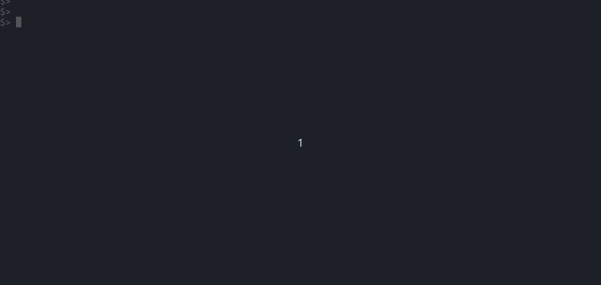

# lookatme.contrib.render

This is a [lookatme](https://github.com/d0c-s4vage/lookatme) extension that
renders code blocks of supported languages into images, which are then
rendered using whichever image rendering options the user has available.

To get something useful out of this extension, you must have an image-rendering
contrib extension installed for lookatme that is able to display images, such
as [lookatme.contrib.urwid_ueberzug](https://github.com/d0c-s4vage/lookatme.contrib.image_ueberzug).
See [lookatme's list of known extensions](https://github.com/d0c-s4vage/lookatme)
for other potential options.

## Example

After installing this lookatme, this extension, and
[lookatme.contrib.urwid_ueberzug](https://github.com/d0c-s4vage/lookatme.contrib.image_ueberzug),
you should be able to see something like this:



## Installation

```bash
pip install lookatme.contrib.render
```

## Usage

Enable this plugin by adding it to the metadata in the head of the markdown file.

```txt
---
title: <title>
author: <author>
extensions:
  - render
---
```

The following languages are currently supported:

| Code-block Language(s) | Renderer                                                 | Executable Required | Note                                                                    |
|------------------------|----------------------------------------------------------|---------------------|-------------------------------------------------------------------------|
| `dot`, `graphviz`      | [Graphviz](https://graphviz.org/)                        | `dot`               | `apt-get install graphviz`                                              |
| `mermaid`              | [mermaid.cli](https://github.com/mermaid-js/mermaid-cli) | `mmdc`              | `npm install mermaid.cli; export PATH="$PATH:$(pwd)/node_modules/.bin"` |

The height of the rendered image can be set by either appending `-N` or `N`
to the codeblock language to specify the number of rows the rendered image
should use when being displayed.

The example below will render a mermaid-js graph with a height of 10 rows:

~~~
```mermaid-10
graph TD
  A0 -> B
  A1 -> B
  B -> C
  C -> D
```
~~~
