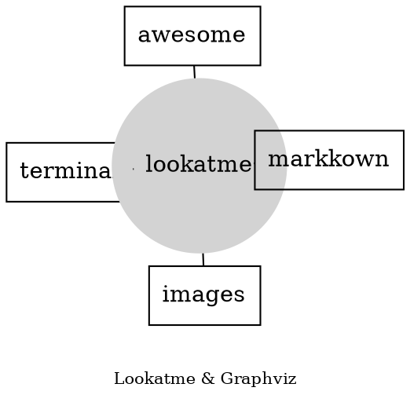
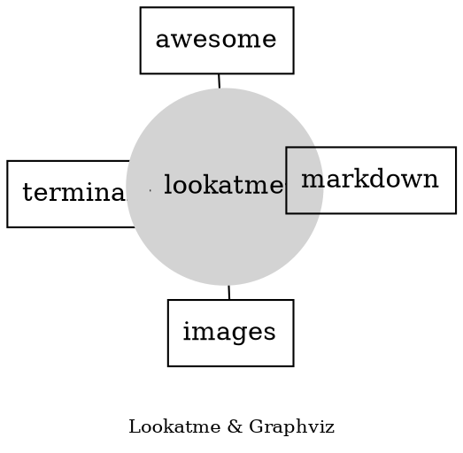
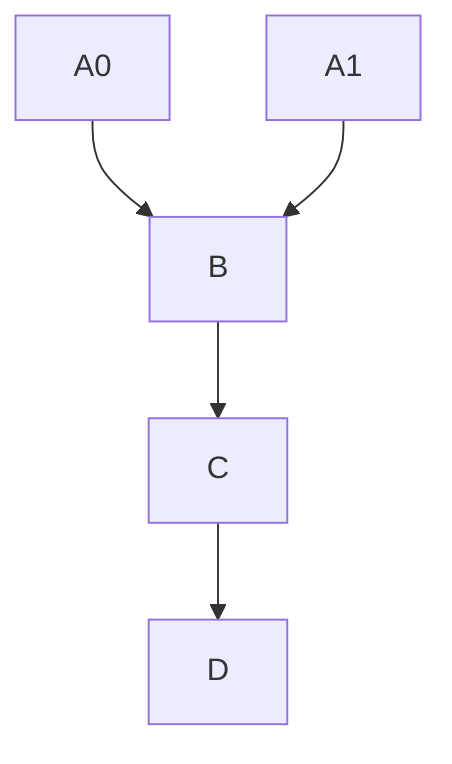

# Graphviz Rendering

Source

~~~

~~~

# Graphviz Rendering

Rendered, requires graphviz to be installed and the `dot` executable
to be in your `$PATH`

# Mermaid JS Rendering

Source

~~~

~~~

# Mermaid JS Rendering

Rendered. Requires mermaid-js to be installed and `mmdc` to be in your
`$PATH`.

